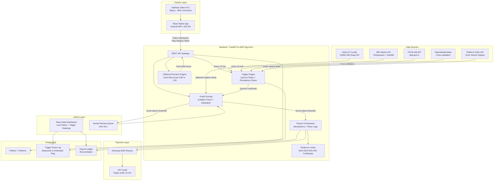

# GRIP: Gig Risk Income Protection

> Parametric Income Insurance for India's Food Delivery Partners

Delivery partners spend 10 hours a day gripping a handlebar, navigating rain, heat, and smog to keep India's cities fed. GRIP is built around that reality: a parametric income protection system that pays out automatically when the conditions they work in make it impossible to earn. When the weather stops them working, we make sure they still get paid.

---
    
## Why GRIP

The name is both an acronym and a deliberate product statement.

**G** - Gig: The product is built exclusively for platform-based gig workers. Not informal workers broadly, not SMEs, not agriculture. Food delivery partners on Zomato and Swiggy.

**R** - Risk: The platform performs continuous, real-time risk assessment. Every partner has a dynamic risk profile based on their operating zone, vehicle type, city, and season. Risk is not a one-time onboarding calculation; it is recalculated weekly.

**I** - Income: The only thing we protect is income. Not vehicles, not health, not life. Lost wages caused by verified external disruptions. Nothing else.

**P** - Protection: The product is a genuine safety net, not a performance benefit or a loyalty reward. Coverage is unconditional and uniform across all enrolled partners. It does not depend on a platform ranking, a minimum order count, or a claims process.

The word GRIP itself carries the product's intent. These workers grip a handlebar for 10 hours a day in conditions most people would not step outside in. GRIP is the financial equivalent of that physical act: holding on when external conditions try to knock you off.

---

## The Problem

On August 15, 2025, Mumbai received 300mm of rainfall in under 24 hours. Zomato and Swiggy halted deliveries across Chembur, Parel, Andheri, Wadala, and Thane for five consecutive days ([Economic Times, August 2025](https://m.economictimes.com/tech/technology/heavy-rains-flooding-disrupt-delivery-business-in-mumbai/articleshow/123391592.cms)). For the average Swiggy or Zomato partner earning a weekly net income of Rs 4,100 to Rs 5,500 ([MoneyControl, 2024](https://www.moneycontrol.com/news/business/startup/how-much-do-delivery-partners-actually-earn-a-look-inside-the-pay-model-for-gig-workers-on-zomato-swiggy-13756512.html)), that week simply did not exist. No orders. No income. No safety net.

This was not a freak event. Delhi NCR saw a historic monsoon deluge on July 8-10, 2023, forcing both platforms to suspend large delivery clusters ([Economic Times, July 2023](https://m.economictimes.com/industry/services/hotels-/-restaurants/online-deliveries-in-deep-water-after-heavy-rains-as-monsoon-lashes-northern-india/articleshow/101650803.cms)). Bengaluru's Sarjapur Road, Bellandur, and Whitefield came to a standstill on September 6-7, 2022 ([The News Minute, September 2022](https://www.thenewsminute.com/karnataka/bengaluru-rains-delivery-workers-face-difficulties-e-commerce-shipments-delayed-167643)). Gurugram's NH8 corridor flooded again on September 1, 2025 ([Moneycontrol, September 2025](https://www.moneycontrol.com/news/business/startup/swiggy-zomato-temporarily-halt-food-delivery-services-in-parts-of-delhi-ncr-amid-heavy-rains-13509494.html)). The pattern repeats every monsoon season, every summer heatwave, every Delhi smog cycle, and every time it does, India's delivery partners absorb the full financial hit alone.

The existing insurance coverage these workers receive from their platforms does not address this risk at all. Swiggy provides group accident and medical cover tied to weekly performance rankings ([Swiggy Diaries](https://blog.swiggy.com/press-release/how-delivery-partner-insurance-works-at-swiggy/)). Zomato spent over Rs 100 crore on partner insurance premiums in 2025, but that coverage is for accidents and illness and pays out only after 10 days of inability to work ([Times of India, March 2026](https://timesofindia.indiatimes.com/business/india-business/zomato-delivery-partner-earnings-rose-10-9-in-2025-founder-deepinder-goyal-bats-for-gig-model-flexibility/articleshow/126319253.cms)). Neither platform has any mechanism for the most common disruption their partners actually face: a Tuesday when it rains too hard to go outside.

Only 14% of gig workers in India currently hold any form of insurance ([Dvara Research, 2023, cited in The Actuary India](https://www.theactuaryindia.org/article/insuring-the-invisibles)). The reasons are straightforward: liquidity constraints, product complexity, and a deep-seated distrust of systems that never paid out when they should have. GRIP is built to change all three of those things.

---

## Our Solution

GRIP is a parametric income insurance platform designed exclusively for food delivery partners working on Zomato and Swiggy. The core mechanic is simple: when an independently verifiable external disruption event occurs, such as a heatwave, a flood, or a severe AQI spike, and that event is confirmed to have materially impacted delivery operations, the partner receives a cash payout directly to their UPI ID. No claim to file. No adjuster to argue with. No week-long wait.

This is not an indemnity product. We do not assess individual losses. The trigger fires, the payout goes out. That is the entire claims process.

We cover income loss only. Vehicle repairs, health, life, and accident coverage are explicitly out of scope because those risks are already addressed, however imperfectly, by existing platform covers.

---

## Persona

Meet Arjun. He is 26 years old, from Bareilly, and moved to Delhi three years ago to earn more than his home district could offer. He delivers for Zomato on a petrol two-wheeler he bought on a two-year EMI. He works 10-12 hours a day, six days a week, completing 25-35 orders on a good day. His gross monthly income is around Rs 22,000-25,000 ([MoneyControl, 2024](https://www.moneycontrol.com/news/business/startup/how-much-do-delivery-partners-actually-earn-a-look-inside-the-pay-model-for-gig-workers-on-zomato-swiggy-13756512.html)). After fuel, maintenance, and phone recharges, his weekly net income lands between Rs 4,100 and Rs 5,500. His fixed obligations every month are Rs 4,200 in rent for a shared room in Dwarka, Rs 1,800 in EMI for the bike, Rs 800 sent home to his mother, and roughly Rs 3,000 in food and daily expenses. That leaves him almost nothing. He has no savings beyond two weeks of income.

Arjun has heard of insurance. He remembers his father buying a policy from an agent in Bareilly that never paid out when they needed it. He does not trust agents. He has never downloaded an insurance app because he does not understand what it covers or whether it will actually work when something goes wrong. He pays for things he can see and feel. UPI he trusts completely because it has never lied to him.

Between October and January, Delhi's AQI crosses 300 and sometimes reaches 400 for days at a stretch. On those days Arjun makes a calculation: if he rides in this air for ten hours, his chest will hurt for a week. So he stays home. His income that week drops to Rs 1,500 or less. He skips sending money home. He borrows Rs 500 from a friend for groceries. His EMI does not care about the air quality index.

When the monsoon comes in July, it is worse. He once got caught in a downpour near Connaught Place and his phone stopped working. He lost two hours of income waiting it out under a flyover. On the days Zomato sends a notification saying deliveries are suspended in his zone, he sits in his room watching his earnings counter stay at zero.

Arjun does not need a complex financial product. He needs a system that notices when his city makes it impossible for him to work, and puts money in his account before he has to make that call home to explain why the transfer is not coming this week.

That is the only problem GRIP is trying to solve. Everything else is secondary.

**Why Arjun has never bought insurance and what GRIP does differently:**

He has never bought insurance because every product he has seen requires him to pay upfront, wait months to understand if he qualifies, and then file paperwork after something goes wrong. The timing is wrong, the process is opaque, and the language is not his. GRIP deducts the premium automatically from his weekly Zomato earnings settlement before he even sees the money, so the decision never requires active effort. The payout arrives without him filing anything. The notification is in Hindi. The amount is specific and predictable. For the first time, the product is structured around how he actually lives, not around how an insurance company prefers to operate.

---

## Scenario Walkthroughs

### Scenario 1: The AQI Winter (Delhi, November)

Delhi's CPCB-monitored AQI crosses 300 on November 12 and stays there for three consecutive days. GRIP's trigger engine, pulling from the [CPCB real-time AQI API](https://www.data.gov.in/resource/real-time-air-quality-index-various-locations), detects the breach. The composite trigger also checks platform order volume data, which shows a 35% drop in Arjun's operating zone versus his three-month rolling median. Both conditions are met. An automated payout of Rs 400 per disruption day, for three days, hits Arjun's UPI ID within minutes. He receives Rs 1,200. His rent is safe this week.

### Scenario 2: The Monsoon Halt (Mumbai, July)

The Santacruz [IMD weather station](https://city.imd.gov.in/citywx/city_weather_test_try_warnings.php?id=43003) (Station ID: 43003) records 118mm of rainfall in a 24-hour window on July 9. The threshold is 100mm. Swiggy and Zomato both suspend delivery operations in Chembur and Andheri. The trigger fires automatically. No action is required from the partner. Payout is processed.

### Scenario 3: The Summer Heatwave (Delhi, May)

The [Safdarjung IMD station](https://city.imd.gov.in/citywx/city_weather_test_try_warnings.php?id=42182) (Station ID: 42182) records a daily maximum of 44.1°C for two consecutive days. The heatwave trigger activates. Partners registered in the Delhi zone receive their weekly disruption payout. The entire process from data ingestion to UPI credit targets under 15 minutes, benchmarked against [Cashfree Payouts P99 completion data](https://www.cashfree.com/docs/payments/online/webhooks/webhook-indempotency).

---

## Weekly Premium Model

Food delivery partners operate on a weekly earnings cycle. Imposing a monthly or annual premium on a worker who gets paid weekly creates immediate liquidity friction, and liquidity friction is the single biggest driver of insurance non-renewal in the Indian microinsurance market ([ICMIF Foundation India diagnostic report, 2021](https://icmiffoundation.org/wp-content/uploads/2021/06/India-diagnostic-complete-report.pdf)).

GRIP's premium structure is entirely weekly. The base premium is Rs 49 per week, which is below the Rs 83 weekly acceptance threshold established by Dvara Research field studies in 2023 ([The Actuary India](https://www.theactuaryindia.org/article/insuring-the-invisibles)). The actual weekly premium charged to each partner is dynamically adjusted based on their operating zone and historical disruption frequency.

**Premium Formula:**

```
Weekly Premium = Base Premium (Rs 49)
               x Zone Risk Multiplier (0.85 to 1.50)
               x Coverage Tier Multiplier (1.0 / 1.25 / 1.50)
```

Zone Risk Multiplier reflects hyper-local disruption history. A partner operating in Bengaluru's Sarjapur Road corridor, a [documented flood zone](https://www.thenewsminute.com/karnataka/bengaluru-rains-delivery-workers-face-difficulties-e-commerce-shipments-delayed-167643), carries a higher multiplier than one operating in an elevated, historically dry zone. A partner in Delhi's central zones carries a higher AQI-season multiplier than one in Noida's outer sectors.

Coverage tiers are structured as follows:

- **Basic (1x multiplier):** Rs 300 per disruption day, capped at Rs 900 per week
- **Standard (1.25x multiplier):** Rs 400 per disruption day, capped at Rs 1,200 per week
- **Premium (1.50x multiplier):** Rs 500 per disruption day, capped at Rs 1,500 per week

**Critical UX design decision:** Premiums are not collected as a separate payment. They are auto-deducted from the partner's weekly earnings settlement on the platform. This single design choice is the difference between 14% uptake and significantly higher adoption. A landmark Randomized Controlled Trial in Kenya demonstrated that aligning premium collection with income timing increased insurance take-up from 5% to 72%, whereas a 30% price discount had zero statistically significant effect ([Casaburi and Willis, American Economic Review, 2020](https://haushofer.ne.su.se/ec2303/Lecture%204%20-%20Agriculture%20&%20Risk/Non-required%20papers/Casaburi_Willis_AER_2020.pdf)). VimoSEWA confirmed this independently: when premiums were linked to Fixed Deposits, renewal hit 100% compared to 22-41% under voluntary payment schemes ([ICMIF Foundation India diagnostic report, 2021](https://icmiffoundation.org/wp-content/uploads/2021/06/India-diagnostic-complete-report.pdf)).

---

## Parametric Triggers

We define three primary trigger categories for the initial product. All triggers use measured, not estimated, data. IMD's gridded data is flagged as estimated and does not independently trigger payouts. Only station-level measurements qualify. This distinction is critical for regulatory defensibility and payout integrity.

### Trigger 1: Extreme Heat

**Data source:** Official IMD city meteorological stations. [Safdarjung (42182)](https://city.imd.gov.in/citywx/city_weather_test_try_warnings.php?id=42182) for Delhi. [Santacruz (43003)](https://city.imd.gov.in/citywx/city_weather_test_try_warnings.php?id=43003) and Colaba (43057) for Mumbai.

**Threshold:** Daily maximum temperature exceeding 43°C for two or more consecutive days.

**Basis risk safeguard:** Co-trigger requires a greater than 25% drop in platform order volume in the affected zone, compared to the partner's 90-day rolling median.

**Payout:** Rs 300-500 per disruption day depending on coverage tier.

**Calibration note:** SEWA's first-year parametric heat product used a threshold of 43.2°C for seven consecutive days and achieved a 0% loss ratio in year one because the trigger never fired ([SEWA Insurance report, December 2025](https://www.sewainsurance.org/wp-content/uploads/2025/12/Parametric-Heat-and-Rainfall-Insurance-for-Informal-Women-Workers.pdf)). Workers paid premiums and received nothing. Trust collapsed. We deliberately use a lower two-day persistence threshold to ensure the product activates with meaningful frequency, targeting four to six trigger events per city per season. A product that never pays out is not insurance. It is a subscription fee.

### Trigger 2: Heavy Rainfall and Flooding

**Data source:** IMD 24-hour rainfall totals, measured from 08:30 IST to 08:30 IST the following day. Station-first rule applies throughout ([IMD gridded rainfall documentation](https://www.imdpune.gov.in/cmpg/Griddata/Rainfall_25_Bin.html)).

**Threshold:** Greater than 100mm of rainfall in any 24-hour period. This is consistent with IMD's own classification of extremely heavy rainfall and matches the rainfall levels documented across the platform suspension events of 2022-2025 ([Economic Times, August 2025](https://m.economictimes.com/tech/technology/heavy-rains-flooding-disrupt-delivery-business-in-mumbai/articleshow/123391592.cms); [Moneycontrol, September 2025](https://www.moneycontrol.com/news/business/startup/swiggy-zomato-temporarily-halt-food-delivery-services-in-parts-of-delhi-ncr-amid-heavy-rains-13509494.html)).

**Geo-fencing:** Payouts are zone-specific, not city-wide. Documented high-risk microzones including Mumbai's Chembur, Andheri, Parel, and Wadala, and Bengaluru's ORR corridor, Bellandur, and Varthur carry higher multipliers and trigger independently from the broader city index ([Economic Times, August 2025](https://m.economictimes.com/tech/technology/heavy-rains-flooding-disrupt-delivery-business-in-mumbai/articleshow/123391592.cms); [The News Minute, September 2022](https://www.thenewsminute.com/karnataka/bengaluru-rains-delivery-workers-face-difficulties-e-commerce-shipments-delayed-167643)).

**Payout:** Rs 300-500 per disruption day.

### Trigger 3: Severe Air Quality (AQI)

**Data source:** CPCB real-time city AQI index, available via the [Open Government Data portal](https://www.data.gov.in/resource/real-time-air-quality-index-various-locations).

**Threshold:** AQI exceeding 300 (Severe category under CPCB classification) for two or more consecutive days.

**Go Digit benchmark:** Go Digit's live parametric wage-loss pilot for Delhi-NCR migrant workers, run in partnership with K.M. Dastur and Jan Sahas, uses AQI above 400 for 3 out of 5 days as the trigger and pays up to Rs 6,000 ([IBS Intelligence, 2024](https://ibsintelligence.com/ibsi-news/digit-insurance-kmd-launch-parametric-cover-for-delhi-ncr-migrant-workers/)). Our threshold of AQI 300 is intentionally more sensitive to activate coverage during the broader severe pollution window, not only at the extreme end.

**Primary target city and season:** Delhi NCR, October through January. This is the highest-frequency, most data-rich use case for AQI-triggered income loss in India.

### Composite OR-Logic

A payout triggers when either the environmental threshold is met OR the platform order volume signal drops by more than 30% versus the zone's 90-day median. The order volume signal requires co-validation with external data to prevent moral hazard. A platform-only signal without environmental confirmation is not sufficient for a standalone trigger.

---

## Platform Choice: Mobile Application (Android-First, iOS on Roadmap)

GRIP is built as a mobile-first application using React Native, with a separate React web interface for the insurer admin dashboard.

Delivery partners spend 6-8 hours a day inside the Zomato and Swiggy mobile apps. They are entirely comfortable with the install, notification, and in-app payment patterns of a native mobile experience. A mobile app gives us reliable access to GPS and sensor data for fraud detection, persistent push notifications for payout alerts, and a familiar interface that requires no behavioural change from the target user. These are product requirements, not preferences.

**Why Android first:** Android accounts for the overwhelming majority of devices used by food delivery partners in India. Budget Android handsets are the standard across the delivery partner demographic. Zomato and Swiggy both treat Android as their primary partner app platform for the same reason. Launching on Android first is a deliberate prioritisation of the actual user base, not a limitation of the technology.

**Why React Native:** React Native compiles a single JavaScript codebase into a native Android APK and a native iOS IPA separately. The core product logic, UI, API integrations, ML model calls, and fraud detection layer are written once and run on both platforms. The only platform-specific differences are push notification backends (Firebase Cloud Messaging for Android, Apple Push Notification Service for iOS) and build environments. React Native libraries abstract both of these away, meaning the codebase remains unified throughout. There is no stack change between Android and iOS builds.

**iOS:** iOS support is on the V2 roadmap. The technical groundwork is already in place by virtue of using React Native. No architectural changes are required to ship an iOS build. The decision to sequence Android before iOS is purely one of market prioritisation for the launch segment, not technical constraint.

The IAMAI-Kantar 2023 study found that 57% of mobile internet users in India prefer content in Indic languages ([IAMAI-Kantar Internet in India 2023](https://www.mediainfoline.com/article/internet-in-india-2023-report-by-iamai-and-kantar)). The partner-facing app launches in Hindi and English, with Tamil, Telugu, and Kannada added in V2. KYC onboarding uses Aadhaar-based video KYC via Signzy, which achieves a 96% call conversion rate and supports nine Indian languages on connections as low as 75 kbps ([Signzy](https://www.signzy.com/blogs/bringing-kyc-to-every-corner-of-india-with-rbi-video-kyc-security-and-more)).

---

## AI and ML Integration Plan

### Dynamic Premium Calculation

The premium engine uses a gradient boosting model (XGBoost) trained on the following features:

- Partner's operating zone (geo-encoded)
- City and zone historical disruption frequency, derived from IMD and CPCB data using the station-first counting protocol across official stations: Safdarjung (Delhi), Santacruz and Colaba (Mumbai), [Nungambakkam (Chennai, Station ID 43278)](https://city.imd.gov.in/citywx/city_weather_test_try_warnings.php?id=43278), and [Begumpet (Hyderabad, Station ID 43128)](https://city.imd.gov.in/citywx/city_weather_test_try_warnings.php?id=43128)
- Seasonal risk window (pre-monsoon, monsoon, post-monsoon, winter)
- Partner activity profile (average weekly orders, average active hours, vehicle type: EV vs ICE)
- Zone-level order volume volatility (standard deviation of weekly order counts over trailing 12 weeks)

At launch, this model is trained on historical IMD and CPCB disruption data for Delhi and Mumbai. It is retrained continuously as live platform telemetry data is ingested, following the [CloudEvents 1.0 JSON envelope format](https://github.com/cloudevents/spec/blob/main/cloudevents/formats/cloudevents.json) for schema compliance.

The model outputs a Zone Risk Score between 0.85 and 1.50. This score multiplies against the Rs 49 base premium to produce the partner's personalised weekly premium. A new partner with no personal history defaults to the city-zone population median score until four weeks of activity data are accumulated, at which point the model switches to their personal profile.

### End-to-End Decision Flow: From Trigger to Payout

This is the complete sequence of what happens when a parametric trigger event occurs. Every step is automated. No human action is required from the partner at any point.

**Step 1 - Oracle Ingestion (continuous, every 15 minutes)**

The Trigger Engine polls three independent data sources simultaneously: the IMD city station API for temperature and rainfall, the CPCB AQI API via data.gov.in, and OpenWeatherMap as the commercial cross-validation source. Each reading is tagged with a measured-vs-estimated flag and the source station ID before being written to the event log in PostgreSQL.

**Step 2 - Threshold Evaluation**

The rules engine compares each ingested reading against the configured thresholds for the relevant city and trigger type. A threshold breach by a single source does not fire a trigger. The quorum rule requires at least two of three independent sources to confirm the breach before proceeding. This eliminates single-source instrumentation errors and prevents oracle manipulation.

**Step 3 - Persistence Check**

The trigger is not fired on the first day of a breach. The rules engine checks that the threshold has been exceeded for the minimum required consecutive period: two days for heat and AQI triggers, one 24-hour window for rainfall. This persistence check prevents payouts for brief spikes that do not meaningfully disrupt delivery operations.

**Step 4 - Zone-Level Order Volume Cross-Validation**

Once the environmental persistence check passes, the engine queries the platform order volume API for the affected city zones. If zone-level order volume has dropped more than 30% versus the 90-day rolling median, the composite trigger is confirmed. If order volume is normal despite the environmental reading, the trigger is held and logged as a near-miss for model calibration purposes.

**Step 5 - Eligible Partner Identification**

The system queries all partners with active policies in the affected zone whose coverage tier includes the triggered disruption type. Each eligible partner generates a payout intent record with a unique idempotency key derived from the event ID and the partner ID. This prevents duplicate payouts if the system retries.

**Step 6 - Fraud Score Computation**

Before any payout is processed, the Isolation Forest anomaly model scores each payout intent against five signals: Play Integrity or App Attest attestation verdict, GPS-to-network location divergence via Airtel IoT Locate, GNSS raw signal C/N0 consistency, temporal burst position within the zone claim distribution, and device graph cluster membership. Partners scoring below the fraud threshold proceed to Step 7 automatically. Partners scoring above proceed to the Tier 2 or Tier 3 review workflow.

**Step 7 - Payout Orchestration**

Clean payout intents are batched and submitted to Razorpay's bulk payout API. First-time beneficiaries are capped at Rs 4,000 per the UPI cooling period constraint. The orchestrator monitors each payout response code and routes failures to the appropriate retry logic: FL/FP codes wait 24 hours, Z9 codes retry within 2-24 hours, code 091 timeouts wait 60 minutes before status checks. Razorpay's intelligent retry engine provides an additional 8% uplift on collection success ([Razorpay, 2024](https://razorpay.com/blog/upi-autopay-with-intelligent-revenue-protect/)).

**Step 8 - Partner Notification and Evidence Logging**

On UPI credit confirmation, the partner receives a push notification in their preferred language stating the payout amount, the trigger reason, and the days covered. Simultaneously, the Evidence Locker writes a BSA 2023 Section 63 compliant certificate containing the SHA-256 hash of all telemetry associated with that payout event. The complete sequence from Step 1 threshold breach to Step 8 UPI credit targets under 15 minutes median latency.

### Fraud Detection

**GPS Spoofing Detection:** Swiggy's engineering team identified that approximately 8% of their active delivery partners were running cloned apps capable of spoofing GPS location as of 2021 ([Swiggy Bytes engineering blog](https://bytes.swiggy.com/detecting-app-cloning-location-spoofing-on-android-452dd420f390)). Zomato terminates approximately 5,000 partners per month for fraud-related violations ([Economic Times, March 2026](https://m.economictimes.com/tech/technology/5000-delivery-workers-terminated-every-month-on-zomato-deepinder-goyal/articleshow/126331099.cms)). Our fraud layer uses sensor fusion, comparing GPS coordinates against Wi-Fi access point triangulation and cell tower signals, to detect implausible location claims. Incognia's implementation of this approach achieved a 52x improvement in false positive rates for gig economy fraud detection ([Incognia Gig Economy Frontline Report, 2025](https://www.incognia.com/frontline-report-gig-economy-edition)).

**Duplicate Claim Prevention:** Each payout is idempotent. A single disruption event generates exactly one payout record per partner. Idempotency keys are generated at the trigger level and validated before any payout intent is created ([Cashfree webhook idempotency documentation](https://www.cashfree.com/docs/payments/online/webhooks/webhook-indempotency)).

**Anomaly Detection:** An Isolation Forest model flags statistically unusual claim patterns, including partners with activity levels during trigger windows that are dramatically different from their historical baseline, partners whose location data is inconsistent with their declared operating zone, and clusters of partners sharing device IDs or bank accounts.

---

## Technical Architecture



**Backend:** FastAPI (Python). Chosen for async support, automatic OpenAPI documentation, and the ability to serve the ML model as an API endpoint without a separate inference server. Deployed on [AWS t4g.micro](https://aws.amazon.com/ec2/instance-types/t4/) with 20GB gp3 EBS storage at approximately $9-10 per month (ap-south-1 region).

**Frontend (Partner App):** React Native. A single codebase compiles to native Android (APK/AAB) for the launch build and native iOS (IPA) for V2. The app is mobile-first, vernacular-first, and optimised for budget devices with intermittent connectivity. Push notifications use Firebase Cloud Messaging on Android and Apple Push Notification Service on iOS, abstracted through a unified React Native layer so the application code does not diverge between platforms.

**Frontend (Admin Dashboard):** React web, desktop-first, with charts and a city-zone disruption heatmap for insurer analytics. Platform-agnostic by nature.

**Database:** PostgreSQL. Stores partner profiles, policy records, trigger events, payout history, and the full audit trail for every data point that contributed to a trigger decision. Every trigger event record stores the raw source reading, the measured-vs-estimated flag, the station ID, and the timestamp. This is the data governance structure required for regulatory defensibility under IRDAI audit.

**Trigger APIs:**
- IMD city station data for temperature and rainfall: free tier, station-level resolution ([IMD data supply procedures](https://mausam.imd.gov.in/newdelhi/docs/data-procedure.pdf))
- CPCB AQI: free REST API via [data.gov.in](https://www.data.gov.in/resource/real-time-air-quality-index-various-locations)
- OpenWeatherMap free tier: backup and cross-validation source (1,000 API calls per day on free plan)
- Platform order volume API: zone-level order drop signals, integrated via platform data partnership with CloudEvents 1.0 JSON envelope format for schema compliance

**Payments:** Razorpay for all payouts ([Razorpay bulk payouts documentation](https://razorpay.com/docs/x/bulk-payouts/)), with full sandbox support during development.

Key engineering constraint built into the payout orchestrator from day one: first-time payouts to new beneficiaries are hard-capped at Rs 4,000. Banks enforce a UPI cooling period limiting new beneficiary transactions to Rs 5,000 in the first 24 hours, and any amount above this fails 100% deterministically ([SBI Yono - UPI transaction limits](https://sbi.bank.in/web/yono/blog/understand-upi-transaction-limits-cooling-period-and-payment-tips)). The retry engine handles three specific failure codes:

- FL/FP (First Transaction Limit Exceeded): Do not retry. Wait 24 hours or reduce amount below Rs 5,000 ([UPI error codes](https://smartgateway.hdfcbank.com/docs/hdfc-resources/docs/common-resources/upi-error-codes))
- Z9 (Insufficient Funds): Notify sender and retry within 2-24 hours
- Code 091 (Timeout Pending, Axis Bank): Wait 60+ minutes before any action to prevent duplicate debits

[Razorpay reports an 8% uplift](https://razorpay.com/blog/upi-autopay-with-intelligent-revenue-protect/) in debit collections using intelligent retries. Target payout latency is under 15 minutes from trigger confirmation to UPI credit, benchmarked against [Decentro's documented 3.8-second median UPI payout latency](https://decentro.tech/blog/decentro-growth-2025/) for optimised bulk payouts.

---

## Competitive Landscape

No pure-play D2C parametric income insurance product for food delivery partners exists in India today. The market is open.

The closest live product is Go Digit's parametric wage-loss insurance, developed with K.M. Dastur and distributed through Jan Sahas to migrant and construction workers in Delhi-NCR. It uses AQI above 400 for 3 out of 5 days as a trigger and pays up to Rs 6,000 ([IBS Intelligence, 2024](https://ibsintelligence.com/ibsi-news/digit-insurance-kmd-launch-parametric-cover-for-delhi-ncr-migrant-workers/)). GRIP's differentiation: food delivery partners instead of construction workers, a rainfall trigger added, composite trigger design, and B2B2C distribution through platforms rather than NGOs.

VimoSEWA, in partnership with IBISA and AXA Climate, runs a parametric heat pilot for informal women workers in Ahmedabad using a temperature threshold above 43.2°C for seven or more days, paying up to Rs 3,000 ([SEWA Insurance report, December 2025](https://www.sewainsurance.org/wp-content/uploads/2025/12/Parametric-Heat-and-Rainfall-Insurance-for-Informal-Women-Workers.pdf)). Their calibration mistake directly informs our threshold design.

Among platform-embedded products: Swiggy's cover is indemnity-based and tied to performance rankings ([Swiggy Diaries](https://blog.swiggy.com/press-release/how-delivery-partner-insurance-works-at-swiggy/)). Zomato's cover addresses illness and accidents, not environmental shutdowns ([Zomato Health, Safety and Wellbeing report, 2025](https://b.zmtcdn.com/data/file_assets/93720629bed5214e067c1a3a7f4362fb1743054722.pdf)). Neither covers what GRIP covers.

Adjacent insurtechs with relevant infrastructure include [Toffee Insurance](https://timesofindia.indiatimes.com/business/india-business/toffee-insurance-raises-5-5-million-in-series-a/articleshow/72859952.cms) (approximately $12.2M raised, bite-sized microinsurance via UPI), [Onsurity](https://startuptimes.in/insurtech-innovators-indias-startups-insuring-500-million-lives-in-2025/) ($50M+, group health for SME cohorts), Bimaplan (API-led embedded insurance infrastructure), and Zopper (acquired GramCover for rural and informal worker expertise). None compete directly on parametric income protection for delivery partners.

**IRDAI Regulatory Precedent:** TATA AIG General Insurance received sandbox approval for a product titled "Parametric Insurance" under Cohort 1, Tranche 2, tested May through October 2020 ([IRDAI Regulatory Sandbox Tranche 2 approval document](https://irdai.gov.in/documents/37343/1082836/2nd+tranche+of+approvals+under+the+Regulatory+Sandbox+Attachment-1.pdf/27dc711e-e36a-111e-5325-657989bd551d?version=2.0&t=1640589248081)). Operational details are commercially confidential but the approval confirms the IRDAI Sandbox pathway is viable for parametric products. GRIP is designed to follow this pathway under IRDAI Regulatory Sandbox 2025 regulations, which allow up to 36 months of testing.

---

## Market Opportunity

Zomato reported an average of 473,000 monthly active delivery partners for FY25 ([Zomato Annual Report FY2024-25, NSE filing](https://nsearchives.nseindia.com/corporate/ZOMATO_24072025202057_EternalNoticeAnnual_Report202425Signed.pdf)). Swiggy reported approximately 516,000 average monthly transacting partners for the same period ([Voronoi](https://www.voronoiapp.com/business/Swiggy-vs-Zomato-Whos-Winning-Indias-Food-Delivery-War-6452)). Combined, that is approximately 1 million monthly active partners across both platforms.

After adjusting for 30% multi-homing overlap, filtering to the top 150 cities which account for 85% of active partners, and applying a 40% weekly-active rate to the monthly base, the realistic addressable base is 260,000 to 430,000 weekly-active partners.

At Rs 49 per week per partner, with a 55% loss ratio and Rs 150 customer acquisition cost, the break-even enrollment count to cover Rs 1 crore in operating overhead is approximately 20,535 partners. That is under 8% of the conservative addressable base.

**The Compliance Distribution Wedge:** The [Code on Social Security 2020](https://prsindia.org/files/bills_acts/acts_parliament/2020/Code%20On%20Social%20Security,%202020.pdf) mandates that platform aggregators contribute 1-2% of annual turnover (capped at 5% of worker payouts) toward gig worker social security schemes. The specific commencement notification for aggregator contributions is pending as of early 2026 ([DLA Piper GENIE, 2025](https://knowledge.dlapiper.com/dlapiperknowledge/globalemploymentlatestdevelopments/2025/government-of-india-notifies-the-labour-codes-ushers-a-new-era-of-compliances)), but the obligation is established in law. GRIP positions itself as the compliance-ready mechanism through which Zomato and Swiggy discharge this obligation, turning a regulatory liability into a branded worker benefit. Under this B2B2C model, the platform pays the premium on behalf of partners, CAC approaches Rs 150 or below, and adoption is automatic rather than voluntary.

---

## Product Roadmap

**MVP: Core Insurance Engine**

The first build establishes the product foundation: partner onboarding with Aadhaar-based video KYC, policy creation with weekly premium calculation, and the parametric trigger engine connected to IMD and CPCB data feeds. The payout orchestrator runs on Razorpay with the Rs 4,000 first-disbursement cap and code-aware retry logic enforced from day one. The XGBoost premium model is trained on historical IMD and CPCB disruption data for Delhi and Mumbai, the two highest-frequency risk cities. Initial launch targets Delhi NCR for the AQI season (October to January) and Mumbai for the monsoon season (July to September).

**V1: Fraud Layer and Partner Dashboard**

The second build adds the fraud detection layer: GPS spoofing detection via sensor fusion, Isolation Forest anomaly detection for unusual claim patterns, and duplicate claim prevention through idempotency key validation. The partner-facing dashboard goes live, showing active coverage status, payout history, and disruption alerts. The insurer admin dashboard launches with loss ratios, a city-zone trigger heatmap, and a predictive disruption calendar for the upcoming week based on IMD forecast data.

**V2: Multi-City Scale and Platform Integration**

The third build expands city coverage to Bengaluru, Chennai, and Hyderabad, adds the heatwave trigger for summer season, and deepens platform integration to ingest real-time order volume signals directly from partner platforms rather than approximating them from historical baselines. The compliance-as-a-service module for aggregator social security contributions under the Code on Social Security 2020 is activated, enabling B2B2C premium collection at zero marginal CAC. iOS build ships from the existing React Native codebase with no architectural changes required.

---

## Adversarial Defense and Anti-Spoofing Strategy

A parametric insurance platform faces a structurally different fraud threat than a traditional indemnity product. Because payouts are triggered by environmental data rather than individual proof of loss, a coordinated syndicate does not need to fake an accident or a hospital bill. They only need to fake a location. This is a far lower bar, and organised rings in India have demonstrated repeatedly that they will exploit it.

The documented precedent is precise. In 2020, a four-person syndicate in Bengaluru used the "Mock Locations (fake GPS path)" Android application, cycling through approximately 500 SIM cards to simulate delivery routes and drain Ola's commission system of lakhs of rupees before the Central Crime Branch made arrests ([The News Minute, 2020](https://www.thenewsminute.com/atom/four-ola-drivers-bengaluru-cheat-firm-lakhs-rupees-using-fake-location-tech-126392)). In 2023, a similar SIM-cycling scheme was used against Uber, generating fake trips via pre-activated SIM cards, with Risk Entity Watch anomaly detection eventually flagging the ring ([Economic Times, 2023](https://m.economictimes.com/tech/technology/5000-delivery-workers-terminated-every-month-on-zomato-deepinder-goyal/articleshow/126331099.cms)). The attack vector for GRIP is the same mechanic at a larger scale: spoof a location into a live trigger zone, claim the payout, launder it through UPI hops within minutes.

Indian fraud rings operating via Telegram demonstrate a documented operational tempo that makes slow detection fatal. Syndicates use remote Command and Control servers and Telegram bot telemetry for real-time coordination ([Group-IB Classiscam Report, 2023](https://www.group-ib.com/blog/classiscam-2023/)). Stolen funds move through 10-15 UPI or banking hops within minutes of collection, and police advisories consistently identify a 2-4 hour window before recovery becomes impossible. The syndicate structure is divided: Signalers monitor weather alerts and trigger threshold breaches, Operators execute claim submissions, Tool Suppliers distribute spoofing software, and Mule Recruiters manage the bank account networks that receive and disperse funds. When a weather threshold breaches publicly, the Signaler network activates within minutes. GRIP's defense architecture is built around this specific operational timeline, not a generic fraud model.

Simple GPS verification is not a defense. It is the attack surface.

### 1. Differentiating a Stranded Partner from a Bad Actor

The fundamental insight from security research is that GPS coordinates are the easiest signal to fake and therefore the worst signal to rely on alone. The correct architecture asks: what signals cannot be simultaneously faked at scale by 500 actors coordinating via Telegram?

**The Spoofing Stack and Its Failure Modes**

Android GPS spoofing operates through the OS's built-in mock location facility. Common tools including Fake GPS Location by Lexa and GPS Joystick by The App Ninjas inject coordinates via Google Play services' Fused Location Provider mock APIs, which on Android 12 and above causes returned Location objects to be flagged via `Location.isMock() == true` ([Android FusedLocationProviderClient documentation](https://developers.google.com/android/reference/com/google/android/gms/location/FusedLocationProviderClient)). Advanced attackers escalate to root-level frameworks: Magisk with Zygisk modules and LSPosed hooks that tamper with system properties and hide Developer Options to evade client-side detection ([GNSS Spoofing Modeling and Consistency-Check-Based Spoofing Mitigation, ResearchGate, 2025](https://www.researchgate.net/publication/389335580_GNSS_Spoofing_Modeling_and_Consistency-Check-Based_Spoofing_Mitigation_with_Android_Raw_Data)).

The critical failure modes of each tool define GRIP's detection strategy:

- Fake GPS Location (Lexa): Fails against server-side hardware attestation. Detectable via `isMock()==true` if not rooted.
- GPS Joystick: Fails against IMU kinematic consistency checks. Cannot fabricate physically plausible accelerometer streams synchronised with claimed GNSS movement.
- VirtualXposed / Parallel Space: Fails hardware-backed attestation. Leaves container package artifacts in filesystem paths.
- Magisk / LSPosed: Brittle against Android 13+ strong integrity verification. The Play Integrity Fix Zygisk module attempts to spoof build fingerprints but fails when server enforces nonce binding and signature verification.

iOS spoofing scales poorly for large rings. Non-jailbroken iOS requires tethered Xcode GPX simulation per device, making it operationally infeasible for a 500-member syndicate ([Apple DeviceCheck documentation](https://developer.apple.com/documentation/devicecheck/validating-apps-that-connect-to-your-server)). On iOS 15 and above, `CLLocation.sourceInformation.isSimulatedBySoftware` is set to true for software simulation. Jailbroken iOS using MobileSubstrate tweaks leaves detectable filesystem artifacts.

**Hardware-Backed Attestation as the First Gate**

The single most effective control that cannot be defeated by standard spoofing applications is cryptographic hardware attestation enforced server-side. GRIP mandates Google Play Integrity API for every claim submission on Android. The `IntegrityManager.requestIntegrityToken()` call returns a nested JWT ([Play Integrity API documentation](https://developer.android.com/google/play/integrity/overview)). On Android 13 and above, the `MEETS_STRONG_INTEGRITY` verdict provides hardware-backed proof of a locked bootloader and certified OS image ([Android Play Integrity standard requests](https://developer.android.com/google/play/integrity/standard)). GRIP's server rejects any claim submission that does not carry a valid `MEETS_STRONG_INTEGRITY` token with a bound nonce generated server-side for that specific request. This single gate eliminates all emulator farms, all VirtualXposed containers, and all non-rooted spoofing applications simultaneously.

For iOS, Apple App Attest provisions a per-app, per-device key in the Secure Enclave ([Apple DeviceCheck documentation](https://developer.apple.com/documentation/devicecheck)). The server validates the Apple certificate chain, the App ID hash, and a nonce, and subsequent claim requests must sign request-bound data with verification of a strictly increasing counter for anti-replay ([Apple Attestation Object Validation Guide](https://developer.apple.com/documentation/devicecheck/attestation-object-validation-guide)).

Attestation is combined with OAuth 2.0 DPoP (Demonstrating Proof-of-Possession), which binds access tokens to the hardware-backed key. This defeats replay attacks where a valid token is intercepted and reused from a different device.

**GNSS Raw Signal Analysis**

Beyond the OS-level mock flag, GRIP analyses raw GNSS measurements that spoofing applications cannot fabricate: Carrier-to-Noise density (C/N0) and Automatic Gain Control (AGC) readings. Legitimate GNSS signals from satellites show characteristic C/N0 distributions based on satellite geometry and atmospheric conditions. Spoofed signals injected via software show anomalous C/N0 uniformity and AGC patterns inconsistent with real satellite reception ([Detecting GNSS Jamming and Spoofing on Android Devices, NAVIGATION Journal, 2022](https://navi.ion.org/content/69/3/navi.537)). This analysis is performed on-device and the raw measurement hash is included in the claim submission, providing a tamper-evident signal that is independently verifiable server-side.

**Out-of-Band Telecom Verification**

The research finding that changes the architecture most significantly is this: cellular tower triangulation using Enhanced Cell ID with Timing Advance achieves a Root Mean Square Error of 70 to 191 metres in urban India ([GSMA Open Gateway Location API overview, 2025](https://bxbucket.blob.core.windows.net/bxbucket/opengateway-web/uploads/2025/2/overview-location-verification-API-20250220_compressed-1.pdf)). This is sufficient accuracy to determine whether a device is in a flood-affected zone or at home. Faking this signal requires rogue base station hardware operating at telecom scale, which is not feasible for a 500-member Telegram ring.

Airtel, Jio, and Vi have launched network-based APIs under the GSMA Open Gateway framework, including the Airtel IoT Locate API for network-triangulation-based location verification and a SIM Swap API (available from October 2025) that detects recent SIM card changes indicating account takeover ([GSMA Open Gateway Press Release, October 2025](https://www.gsma.com/newsroom/press-release/indian-mobile-operators-help-online-businesses-combat-scams-and-identity-theft-through-new-federated-network-services-supported-by-gsma-open-gateway/)). GRIP integrates these APIs for high-value claim verification. When GPS claims a partner is in a flood zone but the Airtel IoT Locate API places the device 15 kilometres away in a residential area, that divergence is a hard fraud signal. When the SIM Swap API reports the partner's SIM was changed within the past 24 hours - a classic identity churn tactic - the claim is automatically escalated.

The divergence threshold for automatic escalation is 500 metres between GPS-claimed location and network-derived location. Below 500 metres, the claim proceeds normally. Above 500 metres, the claim enters the Tier 2 review workflow described below.

### 2. Detecting a Coordinated Fraud Ring

Individual device signals detect individual fraud. Coordinated ring detection requires a different analytical layer that operates across the entire claims portfolio simultaneously.

**Temporal Burst Detection**

Telegram-coordinated syndicates produce a statistically distinctive temporal pattern: a large volume of location claims from a specific trigger zone arriving within a narrow window immediately after a threshold breach becomes publicly known. GRIP's real-time anomaly engine monitors claim arrival rates per zone per trigger type as a time series. A claim volume spike exceeding three standard deviations above the historical mean for that zone, city, and trigger combination within any 90-minute window triggers an automatic liquidity throttle: payouts for that zone are held in a processing queue pending syndicate analysis before any funds are released. Honest partners whose claims are held during a throttle event receive an immediate in-app notification with an estimated resolution time. The throttle does not deny claims; it delays disbursement by a maximum of 4 hours while the syndicate analysis runs.

**Device Graph and Infrastructure Clustering**

Every device interacting with GRIP is fingerprinted using hardware identifiers, installed application signatures, screen resolution, and system font set. This fingerprint is non-personally-identifying but session-consistent. The device graph clusters fingerprints by shared infrastructure: devices that share an IP subnet, devices that have connected to the same Wi-Fi BSSID, and devices whose SIM cards were purchased from the same batch (detectable via IMSI prefix patterns). A cluster of 50 devices with near-identical fingerprints submitting claims from the same trigger zone within a 90-minute window is a structurally impossible legitimate scenario. The 2020 Ola Bengaluru case involved exactly this pattern: 500 SIM cards cycling through four devices, creating an infrastructure cluster that was detectable in retrospect but not in real time. GRIP's graph analysis is designed to detect this pattern in real time.

**Privacy-Preserving Cross-Platform Federation**

The most sophisticated syndicates may exploit multiple platforms simultaneously. GRIP's feature store is architected to participate in the RBI Innovation Hub's Digital Payments Intelligence Platform (DPIP), which employs a cross-silo federated learning architecture where participating institutions train fraud models locally and share only encrypted model weight updates via Multi-Party Computation and Secure Enclaves, achieving API latency under 500 milliseconds ([RBIH DPIP Architecture, 2024-2025](https://rbihub.in/projects/digital-payments-intelligence-platform)). NPCI is separately piloting a score-level fusion system with partner banks to reduce false positives in UPI transactions. Participation in these networks means GRIP's fraud model benefits from syndicate signals detected across the broader Indian fintech ecosystem, not only from GRIP's own claims data. A ring that has been flagged on another platform is flagged on GRIP before they submit their first claim.

**Securing the Parametric Oracle**

The research reveals a third attack surface that most teams will entirely miss: the weather data source itself. In 2016-2017, two Colorado ranchers physically tampered with National Weather Service rain gauges by plugging funnels with silicone and cutting wires to artificially lower precipitation readings and avoid triggering crop insurance payouts. They were sentenced to federal prison and ordered to pay over $6.5 million in restitution ([U.S. DOJ Press Release, 2024](https://www.justice.gov/usao-co/pr/two-southeastern-colorado-farmers-sentenced-federal-prison-and-will-pay-over-65-million)). In decentralised finance, oracle manipulation is the leading cause of protocol losses: $403.2 million across 41 incidents in 2022 alone, including the Mango Markets exploit where an attacker manipulated a low-liquidity token price to drain $110 million from the protocol ([CFTC Charges against Avraham Eisenberg, 2022](https://www.cftc.gov/PressRoom/PressReleases/8647-23)).

The IMD's public data feeds use IP whitelisting and HTTPS but carry no cryptographic response signing and no tamper-evident timestamps. The CPCB explicitly disclaims that its live AQI data may contain abnormal values due to instrumental errors ([ChainScore Labs - Parametric Insurance Triggers Are a Honeypot for Hackers, 2024](https://chainscorelabs.com/pt/blog/real-estate-tokenization-hype-vs-reality/insurance-and-risk-mitigation/why-parametric-triggers-create-new-attack-vectors)). A single-source oracle built on either feed is brittle by design.

GRIP's oracle architecture uses a minimum three-source quorum: IMD station data, CPCB AQI, and a commercial provider (OpenWeatherMap or Tomorrow.io) as the third independent source. The trigger decision uses a median estimator across all three sources, discarding statistical outliers. A trigger fires only when at least two of three independent sources confirm the threshold breach. A manipulated or instrumentation-faulty reading from a single source cannot fire a payout. For the HTTPS data feeds that lack native cryptographic signing, GRIP implements attested TLS proofs using a DECO-style protocol to generate verifiable proofs of data origin that can be audited post-event ([ChainScore Labs, 2024](https://chainscorelabs.com/pt/blog/real-estate-tokenization-hype-vs-reality/insurance-and-risk-mitigation/why-parametric-triggers-create-new-attack-vectors)).

### 3. UX Balance: Handling Flagged Claims Without Penalising Honest Workers

The 2024 Dvara Research study on PMJJBY and PMSBY found that beneficiaries who were enrolled but unaware of their coverage or who received no payouts stopped engaging with the product entirely. A fraud system that generates false positives during genuine weather emergencies is a product-destroying event, not an operational inconvenience.

GRIP's flagged claim workflow uses a three-tier risk classification:

**Tier 1 - Auto-Approved**

Partners whose Play Integrity or App Attest token carries `MEETS_STRONG_INTEGRITY`, whose GPS-to-network location divergence is below 500 metres, whose GNSS raw signal patterns are consistent with genuine outdoor exposure, and whose claim arrival timing is within the normal distribution for their zone and trigger type receive automatic approval. Payout is processed immediately via Razorpay with a target latency under 15 minutes from trigger confirmation to UPI credit. No human intervention. This covers the large majority of legitimate claims.

**Tier 2 - Soft Hold, Maximum 4 Hours**

Partners who trigger one or two anomaly signals but not a full fraud signature are placed on a soft hold. The payout is not denied. The partner receives an immediate in-app notification in Hindi or their preferred language: "Your payout is being verified. This is a routine check during high-claim periods. You will receive payment within 4 hours." The secondary verification presents one action: a 10-second liveness video processed entirely on-device using on-device ML, with no biometric data transmitted to servers. For partners in genuine network-degraded conditions where video upload is infeasible, a single-tap location confirmation is accepted as an alternative. A genuine partner stranded in a flood zone will complete either action without hesitation. A bad actor sitting at home with a spoofing application faces an environment check their residential surroundings cannot pass.

**Tier 3 - Manual Review, 24-Hour SLA**

Partners who trigger multiple high-confidence fraud signals, who are members of a detected device cluster, or who fail Tier 2 verification are routed to a human review queue. The payout is held. The partner receives a notification with a plain-language explanation and a 24-hour SLA commitment. Human reviewers have access to the full signal stack: attestation verdict, GPS-to-network divergence measurement, GNSS raw signal analysis, device graph cluster membership, platform activity trail, and the temporal burst analysis for their zone. All review decisions are logged with structured reasoning fields for regulatory audit.

**Evidence Locker and Legal Readiness**

The cybercrime conviction rate in India in 2023 was 27.6%, with a court pendency rate of 92.6% ([NCRB Crime in India 2023](https://www.ncrb.gov.in/uploads/files/2CrimeinIndia2023PartII2.pdf)). Cases take years to reach verdict. Evidence collected today must be admissible in court years later under the Bharatiya Sakshya Adhiniyam 2023, which replaced the Indian Evidence Act and governs digital evidence admissibility from July 1, 2024. Section 63 of the BSA mandates a two-part certificate containing the SHA-256 cryptographic hash of every electronic record to prove its integrity in court ([Bharatiya Sakshya Adhiniyam 2023](https://upload.indiacode.nic.in/view-casepdf?type=act&id=AC_CEN_5_23_00049_2023-47_1719292804654)).

GRIP's Evidence Locker automatically generates BSA 2023 Section 63 compliant certificates for every piece of collected fraud telemetry: device fingerprints, sensor logs, network metadata, attestation tokens, and claim submission records. System clocks are synchronised with NIC/NPL NTP servers as mandated by CERT-In Direction 70B (April 2022), and all logs are retained for a rolling 180-day period within Indian jurisdiction ([CERT-In Direction 70B](https://www.cert-in.org.in/PDF/CERT-In_Directions_70B_28.04.2022.pdf)). The Delhi High Court ruling in Neetu Singh v. Telegram (2022) established that Indian law enforcement can obtain Telegram user metadata including mobile numbers and IP addresses via court order. When a syndicate is identified, GRIP's Evidence Locker produces a court-ready evidence package that law enforcement can act on immediately rather than spending months reconstructing a forensic record.

**Appeals and Fairness Diagnostics**

Every denied claim generates an automatic appeals notification with a plain-language explanation. The appeals process is a single in-app button triggering re-review by a senior analyst within 48 hours. Partners who successfully appeal a wrongfully denied claim receive their payout plus a Rs 50 goodwill credit. Fairness diagnostics are run monthly: if any segment (EV vs ICE riders, specific city zones, specific platforms) shows a disproportionately high false positive rate, the model is recalibrated before the next trigger cycle. Target false positive rate is below 2% of all legitimate claims. A Fraud Control Management Committee chaired by the Chief Risk Officer, consistent with the governance structure documented at Acko ([Acko Anti-Fraud Policy](https://www.acko.com/wp-content/uploads/2020/06/anti-fraud-policy.pdf)), reviews the monthly diagnostics and has authority to adjust model thresholds without engineering intervention.

The architecture is asymmetric by design. A spoofing actor must simultaneously defeat hardware attestation, GNSS raw signal analysis, network-level location verification via Airtel IoT Locate, temporal burst detection, and device graph clustering. Defeating any one of these layers in isolation is feasible. Defeating all five simultaneously, at scale, within the 2-4 hour window before funds are irrecoverable, is not.

---

## Team Exogeneous